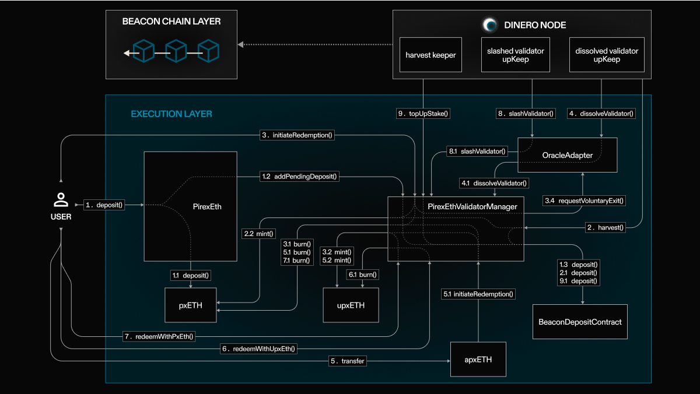

# Pirex Ether

Pirex Ether is an Ethereum liquid staking solution that forms the foundation of the Dinero protocol.

## Setup

From inside the project directory:

1. `forge i` to install contract dependencies
2. `forge build` to compile contracts

(Forge version: `0.2.0`)

## Overview

**[[Contract Contents]](docs/src/SUMMARY.md)**

Pirex provides ETH holders to take advantage of Ethereum staking rewards through pooling. 

As a user of Pirex, you can benefit in the following ways:

- Yield as a resulting of block validation, block attestation and MEV.
- Efficient, autonomous compounding of rewards into pxETH

And more. We're continuously improving our products and adding value to our users, and will make announcements as additional utility is available for our tokens. Please follow us on Twitter ([@dinero_xyz](https://x.com/dinero_xyz)) to stay in the loop ❤️.

### How Does It Work?

pxETH: The Pirex-wrapped version of ETH, handled in a way to attain benefit from MEV, Execution layer and Consensus layer rewards to the user. pxETH token holders can earn yield by staking in `AutoPxEth`. pxETH token holders can redeem their pxETH for ETH.

### Architecture Diagram

Below are visualizations of how the Pirex ETH contracts interact with one another as well as with external contracts (e.g. beacon chain deposit) as a result of different user interactions. 
Please note that the diagrams do not cover some details to keep the diagram easy for understanding on token flow (for e.g. the `setFee` call for configuring `deposit`, `redemption` and `instantRedemption` fees, adding initialized validators).

<figure align="center">
  
  <figcaption>Pirex ETH Smart Contract Architecture</figcaption>
</figure>

### Core Contract Overview

**[PirexEthValidators.sol](./docs/src/src/PirexEthValidators.sol/abstract.PirexEthValidators.md)**
- This contract manages validators and deposits for the ETH 2.0 (Beacon chain) deposit contract
    - It allows governance to set contract addresses, manage validator queues, trigger deposits, manage rewards, handle slashing and top-up operations, and more
    - Validators are managed through various queues and can be added, swapped, popped, removed, or cleared
    - Validators can be slashed, dissolved, and topped up based on different conditions
    - Validators can be redeemed and rewarded with upxETH tokens
- Handles the MEV, Execution layer and Consensus layer rewards
- Keeps the status of validators in sync via that on consensus layer
- **`GOVERNANCE_ROLE`** - manages validator queue, set fee params, pausing deposits to beacon chain deposit contract
- **`KEEPER_ROLE`** - harvest rewards, update status when a validator is slashed, and top up the validator stake when active balance goes below effective balance
- **`DEFAULT_ADMIN_ROLE`** - set external contract addresses

**[PirexEth.sol](./docs/src/src/PirexEth.sol/contract.PirexEth.md)**
- Main entrypoint for handling interactions with pxETH
- Allows depositing ETH to receive pxETH tokens and staking them in the autocompounding vault on behalf of the user
- Allows pxETH holders to redeem pxETH for ETH or upxETH
- Manages fees for deposit ETH, redemption and instant redemption of pxETH

**[ERC1155Solmate.sol](./docs/src/src/tokens/ERC1155Solmate.sol/contract.ERC1155Solmate.md)**
- Modified ERC1155 Solmate `mint`, `mintBatch` , `burn` and `burnBatch` by making it permissioned

**[OracleAdapter.sol](./docs/src/src/OracleAdapter.sol/contract.OracleAdapter.md)**
- The contract acts as an intermediary between different contract components, facilitates setting contract addresses, managing access control roles, and handling interactions related to validator exits and dissolution
- Has permission to interact with `PirexEth` for notifying validator to voluntary exit
- Has permission to interact with `PirexEth` when validator is dissolved
- **`ORACLE_ROLE`** - permission to update the state of the validator when it is dissolved

**[PirexFees.sol](./docs/src/src/PirexFees.sol/contract.PirexFees.md)**
- The contract handles the distribution of fees generated by the protocol
- Allows owner (Dinero multisig) to configure fee recipient addresses and treasury fee percentages
    - When fees are distributed, the specified token amount is split between the treasury and contributors according to the configured percentages

**[DineroERC20.sol](./docs/src/src/DineroERC20.sol/contract.DineroERC20.md)**
- This contract extends the ERC20 standard by adding permissioned minting and burning capabilities
- Implements access control mechanisms to restrict who can perform these actions
- Defines the **`MINTER_ROLE`** and **`BURNER_ROLE`** roles, and only accounts with these roles are allowed to mint and burn tokens, respectively
- The access control mechanisms are facilitated through the use of OpenZeppelin's `AccessControlDefaultAdminRules` contract

**[PxEth.sol](./docs/src/src/PxEth.sol/contract.PxEth.md)**
- This contract represents the main token for the PirexEth system within the Dinero ecosystem
    - Is a derivative of the `DineroERC20` contract
- The contract introduces an **`OPERATOR_ROLE`** that allows certain addresses to perform specific actions, eg. approve allowances between specified accounts

**[AutoPxEth.sol](./docs/src/src/AutoPxEth.sol/contract.AutoPxEth.md)**
- Autocompounding vault for staked pxETH, adapted from pxCVX vault system
- Provides a mechanism for users to stake and unstake pxETH tokens
  - Accepts pxETH deposits and issues share tokens (apxETH) against them
- Compounds pxETH rewards into more pxETH by harvesting ETH rewards (MEV, Consensus layer and Execution layer)
  - Rewards are streamed over time based on a set rewards rate and duration
  - Harvesting of rewards is done by the contract, and a platform fee is deducted before rewards are compounded
- Provides a series of permissioned methods that enables the Dinero multisig to configure platform (vault's fee recipient), `PirexEth` contract, withdraw penalty and `platformFee`
- Modifies `transfer` and `transferFrom` method to `initiateRedemption` if apxETH are transferred to PirexEth

**[RewardRecipient.sol](./docs/src/src/RewardRecipient.sol/contract.RewardRecipient.md)**
- This contract is responsible for harvesting validators rewards, dissolving and slashing validators and setting protocol’s contracts addresses (`OracleAdapter`, `PirexEth`)
- The governance and keeper roles are responsible for managing various operations related to validators and their rewards
